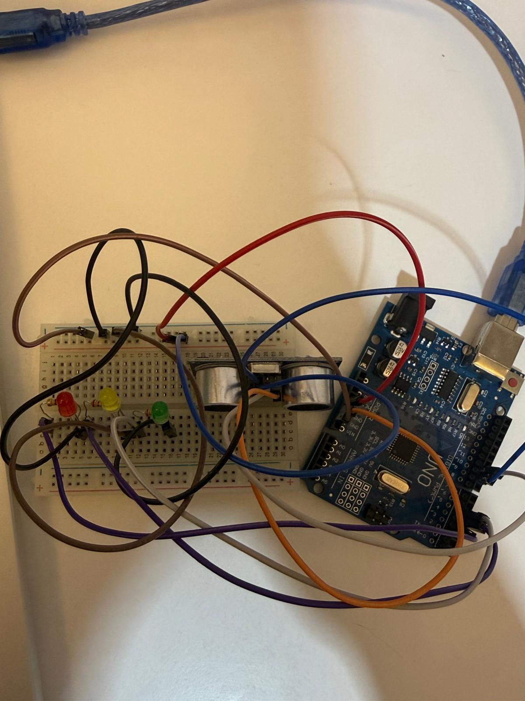

# Ultrasonik Park Sensörü Arduino Projesi

Breadboard üzerinde HC-SR04 mesafe sensörü ve 3 renk LED kullanarak yaptığım araç park/mesafe uyarı devresi. Nesne yaklaştıkça LED'lerin rengi değişiyor, çarpma mesafesine geldiğinde ise panik moduna geçiyor ve kırmızı LED uyarı amaçlı hızlıca yanıp sönüyor.

### Devre Fotoğrafı
Fiziksel bağlantıları breadboard üzerine kurup test ettim:

### Kullanılan Malzemeler
* Arduino Uno
* HC-SR04 Ultrasonik Sensör
* 3x LED (Kırmızı, Sarı, Yeşil)
* 3x 220Ω Direnç (Kırmızı - Kırmızı - Kahverengi - Altın)
* Breadboard ve bolca jumper kablo

### Pin Bağlantıları

**HC-SR04 Sensör:**
* VCC -> 5V
* GND -> GND
* Trig -> Pin 9
* Echo -> Pin 10

**LED'ler:**
* Yeşil LED -> Pin 5 (Güvenli mesafe)
* Sarı LED -> Pin 4 (orta mesafe)
* Kırmızı LED -> Pin 3 (Çok yakın / Çarpma mesafesi)

---

### Nasıl Çalışıyor?
Sensör önündeki engelle olan mesafeyi anlık ölçüyor:
* Engel uzaktayken sadece yeşil yanıyor.
* Biraz yaklaşınca sarıya dönüyor.
* Mesafe tehlikeli seviyeye indiğinde kırmızı LED devreye giriyor; mesafe kritik eşiğin de altına düşerse "artık çarpacaksın" uyarısı vermek için kırmızı LED hızla yanıp sönmeye başlıyor.

### Çalıştırma
Kodu Arduino IDE ile karta yükledikten sonra Serial Monitor'ü açarak okunan cm değerlerini canlı izleyebilirsiniz.Breadboard üstündeki ledlerin davranışlarını gözlemleyebilirsiniz.
